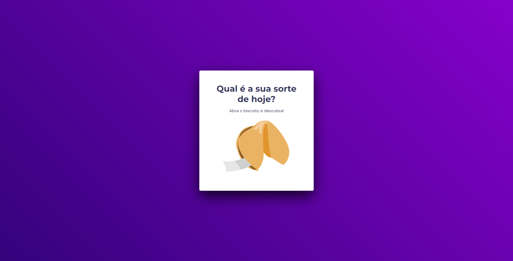

  

## 💻 Projeto

Esee é um projeto tem como finalidade você clicar na imagem do biscoito para abri-lo, então é te gerado uma mensagem da sorte

## 🚀 Tecnologias

Esse projeto foi desenvolvido durante o NLW da Rocketseat com as seguintes tecnologias:

- HTML
- CSS
- Javascript
- Git e Github

## 🏷️ Layout

Você pode visualizar o layout do projeto através
[desse link](<https://www.figma.com/file/rsRksDcHW42cVzVqwKmEjf/Jogo-Adivinha%C3%A7%C3%A3o-(Copy)?type=design&node-id=0%3A1&t=7CmSIutk6p413weN-1>)
É necessário ter uma conta no [Figma](https://www.figma.com)
